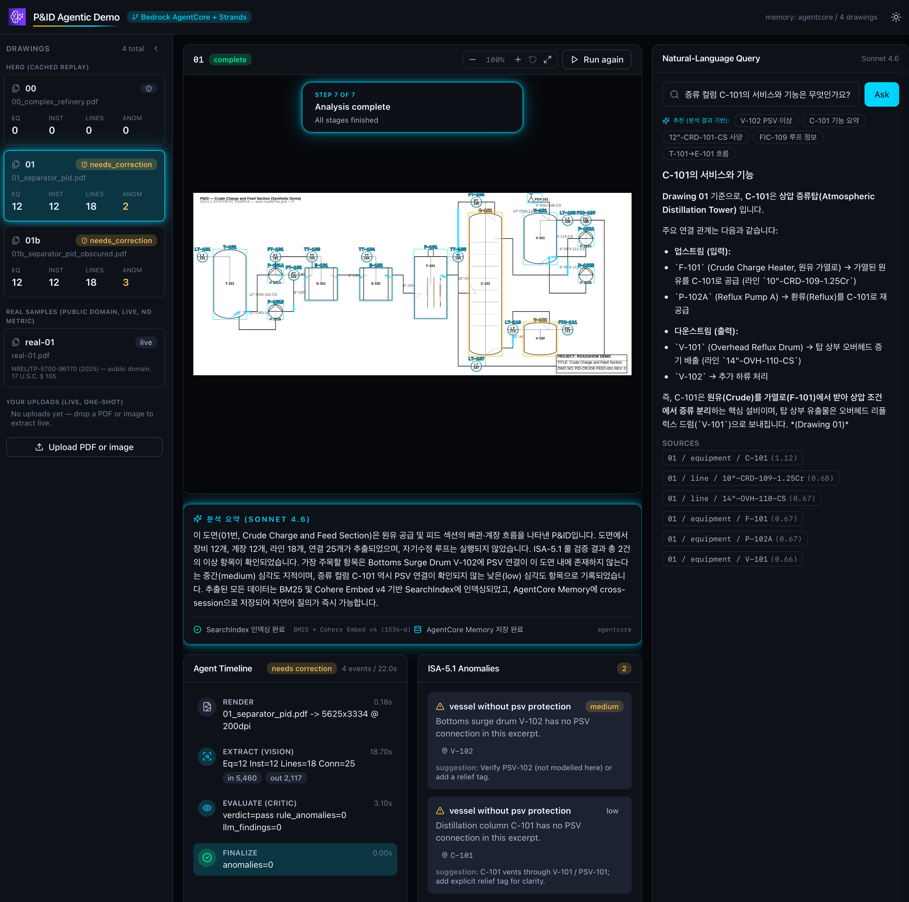
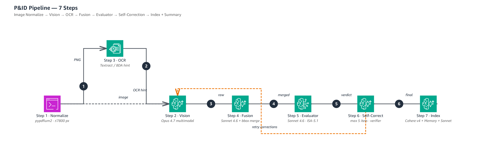
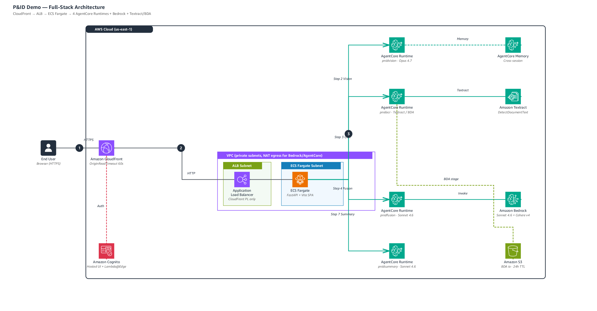

<h1 align="center">P&amp;ID Agentic Extraction</h1>

<p align="center">
  <strong>엔지니어링 도면(P&amp;ID)을 구조화된 데이터로 변환하는 멀티 에이전트 시스템</strong><br/>
  6개의 Amazon Bedrock AgentCore Runtime 이 협업하여 장비, 밸브, 계장, 라인, 연결 관계를 자동 추출합니다.
</p>

<p align="center">
  
  
  
</p>

<p align="center">
  
</p>

### Demo

<p align="center">
  <a href="https://youtu.be/hSbTmIyyIsg" target="_blank" rel="noopener noreferrer">
    
  </a>
</p>

---

## How It Works

도면(PDF/PNG)을 업로드하면 **6개의 전문 에이전트**가 순차적으로 협업합니다.

<p align="center">
  
</p>

| Step | Agent | Model | What it does |
|---|---|---|---|
| 1 | Image Normalizer | pypdfium2 | PDF/PNG → single PNG (≤7800 px) |
| 2 | **Zone Scout → Zone Specialists** | Sonnet 4.6 + Opus 4.8 | 도면을 3~6개 영역으로 분할 → 영역별 상세 추출 |
| 3 | OCR Anchor | Textract | 텍스트 + pixel-accurate bbox 추출 |
| 4 | Fusion | Sonnet 4.6 | Vision 결과와 OCR 좌표를 매칭 |
| 5 | Evaluator | Sonnet 4.6 + ISA/DIN 룰 엔진 | 추출 결과 검증 + anomaly 탐지 |
| 6 | Self-Correction | Opus 4.8 + Sonnet 4.6 Verifier | 누락 항목 자동 보강 (max 5 iters) |
| 6.5 | **Valve Scanner** | Opus 4.8 | 프로세스 라인 위 inline valve 심볼 전수 감지 |
| 6.7 | **Connection Stitcher** | Opus 4.8 | 라인 경로 추적 → 빠진 connection 채움 |
| 7 | Index + Summary | Cohere Embed v4 + Sonnet 4.6 | SearchIndex 인덱싱 + 한국어 요약 + 자연어 질의 |

---

## Architecture

<p align="center">
  
</p>

### 6 AgentCore Runtimes

| Runtime | Model | Role |
|---|---|---|
| `pnidvision` | Claude Opus 4.8 | Zone-specialist extraction (equipment, instruments, lines) |
| `pnidocr` | AWS Textract | OCR anchor (text + bbox + confidence) |
| `pnidfusion` | Claude Sonnet 4.6 | Spatial matching (bbox merge, Levenshtein line swap) |
| `pnidsummary` | Claude Sonnet 4.6 | Korean NL summary + suggested queries |
| `pnidvalve` | Claude Opus 4.8 | Inline valve symbol detection per zone |
| `pnidstitch` | Claude Opus 4.8 | Process line tracing + connection gap-fill |

### Convention Auto-Detect

도면의 표기 표준을 OCR 결과에서 자동 판별하여 적합한 prompt, regex, anomaly 룰을 적용합니다.

| Convention | 특징 | 예시 도면 |
|---|---|---|
| **ISA-5.1** (North America) | V-101, PSV-101, `4"-FG-101-CS` | 합성 drawing 00/01/01b |
| **DIN EN 10628** (Europe) | KA002, BA101, WA008, `LR040.22040-80-40C1200 NF 223` | 합성 drawing 02 (Kälteerzeugung) |

환경변수 `PNID_CONVENTION` 으로 강제 가능: `auto` (default), `isa`, `din`.

---

## Quick Start

```bash
# Backend
uvicorn backend.api.main:app --host 127.0.0.1 --port 8000

# Frontend
cd frontend && VITE_PROXY_TARGET=http://127.0.0.1:8000 npm run dev

# Tests
python3 -m pytest tests/backend/
```

### Deploy

```bash
# Docker build
docker buildx build --platform linux/amd64 \
  -f infra/docker/Dockerfile \
  -t <ACCOUNT_ID>.dkr.ecr.us-east-1.amazonaws.com/pnid-demo:vN --push .

# AgentCore Runtimes (6개 모두)
AWS_PROFILE=profile2 python3 scripts/runtime_deploy.py
```

---

## Key Design Decisions

| Decision | Why |
|---|---|
| **Hierarchical zone extraction** (not fixed-grid tiles) | 사람이 도면을 읽듯이 영역을 먼저 파악 → 영역별 전문가가 상세 추출. 큰 도면에서 instrument bbox 0% → 100% 복구 |
| **Separate Valve Scanner** | DIN 도면의 inline valve 는 main extraction 이 놓치는 작은 심볼. 전용 pass 가 0 → 70개 발견 |
| **Post-extraction Connection Stitcher** | equipment 를 먼저 다 찾은 후 "라인을 따라가며 연결 재구성" — 엔지니어의 도면 읽기 순서와 동일 |
| **Convention-aware prompt** | ISA-5.1 과 DIN EN 10628 은 tag/line naming 이 완전히 다름. 단일 prompt 로는 양쪽 대응 불가 → auto-detect + dual prompt |
| **Textract (OCR) 유지** | BDA, Qwen3 VL 실험 후 Textract 의 LINE-block 특성이 fusion 과 최적 호환 확인. pixel-accurate bbox 보장 |

---

## Project Structure

```
backend/
  agents/
    conventions/        # ISA-5.1 / DIN EN 10628 prompt + regex + rules
    strands_orchestrator.py       # 7-step pipeline entry
    strands_zone_scout.py         # Hierarchical zone detection
    strands_extractor_hierarchical.py  # Zone-specialist fan-out
    strands_valve_scanner.py      # Valve symbol detection
    strands_connection_stitcher.py    # Connection tracing
    runtime_vision.py   # AgentCore entrypoint: pnidvision
    runtime_ocr.py      # AgentCore entrypoint: pnidocr
    runtime_fusion.py   # AgentCore entrypoint: pnidfusion
    runtime_summary.py  # AgentCore entrypoint: pnidsummary
    runtime_valve.py    # AgentCore entrypoint: pnidvalve
    runtime_stitch.py   # AgentCore entrypoint: pnidstitch
  api/                  # FastAPI + WebSocket
  tools/                # SearchIndex, embedding, image normalize
frontend/               # React + Vite + Tailwind (Cinematic Tech UI)
infra/
  cdk/                  # CloudFront + ALB + ECS Fargate
  docker/               # Container (single uvicorn worker)
data/
  samples/              # Synthetic P&ID (ISA-5.1)
  samples_real/         # NREL public-domain P&ID (see SOURCES.md)
```

---

## Models

| Role | Model ID |
|---|---|
| Vision / Valve / Stitch | `global.anthropic.claude-opus-4-8` |
| Fusion / Summary / NL Query | `global.anthropic.claude-sonnet-4-6` |
| Embedding | `us.cohere.embed-v4:0` (1536-d) |

---

## Data

- 합성 P&amp;ID (ISA-5.1): `data/synthesis/topo_*.py` 에서 결정론적 생성
- DIN 도면 (DIN EN 10628): `data/synthesis/topo_din_kaelte.py` 에서 생성한 합성 도면 02
- 실제 산업 도면 (public domain): `data/samples_real/` — 출처와 라이선스는 `data/samples_real/SOURCES.md`
- 외부 고객 도면은 저장소에 포함하지 않습니다. 업로드한 도면은 서버에 영구 저장하지 않고 30분 TTL 후 자동 삭제

---

<p align="center">
  <sub>Built on Amazon Bedrock AgentCore + Strands Agents SDK</sub>
</p>
